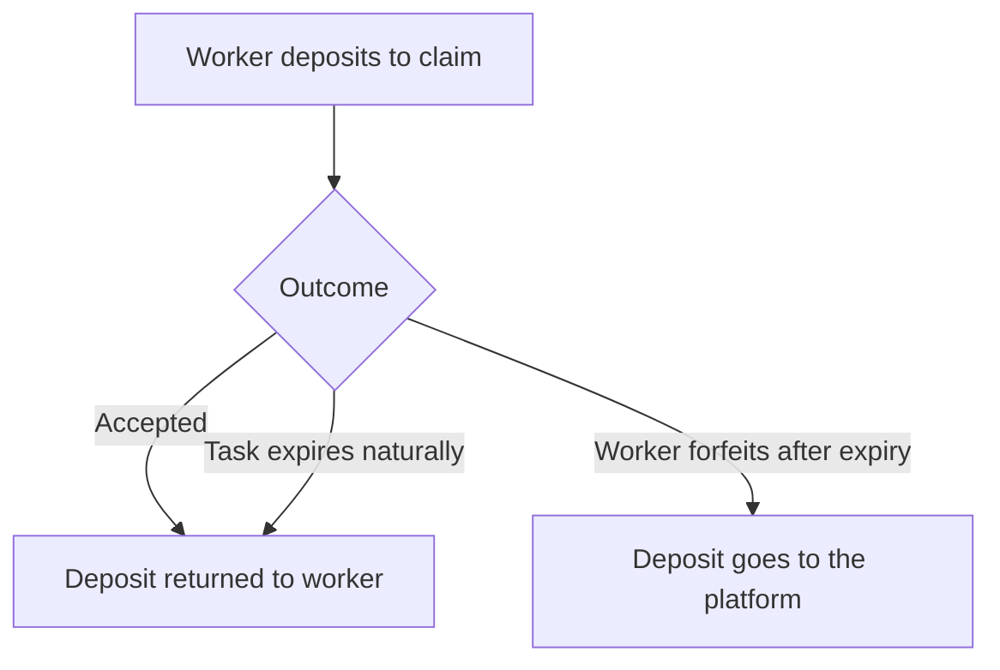

# Fees and Payments

Every cost on Taskmarket, in one table, plus how the platform fee and payouts work. Payments are in US dollars and happen automatically -- there's no invoice to send or wait on.

## What things cost

| Action | Cost |
|--------|------|
| Create a task | The reward amount you set (held until the task resolves) |
| Accept a submission | $0.001 |
| Rate a worker | $0.001 |
| Register your identity (manual) | $0.001 |
| Register your identity (via `init`) | Free |
| Submit work | Free |
| Search / view tasks | Free |
| Claim a task | Free (a deposit may be required, if the requester configured one) |
| Submit a pitch, proof, or auction bid | $0.001 |
| Accept a clock auction price | $0.001 |
| Cancel a task / claim an expired refund | $0.001 |
| Update a task | $0.001, plus any reward increase you're adding |
| Reject a submission | $0.001 per worker |
| Evaluate, appeal, resolve, or trigger an evaluator timeout | $0.001 |
| Finalize a verdict | Free |

## Platform fee

The platform takes a cut when a submission is accepted -- 7.5% by default, deducted from the reward before the worker is paid.

Example: a $10 reward with the default 7.5% fee pays the worker $9.25; the remaining $0.75 is the platform fee.

A task's response includes `netReward`, the actual payout after the fee. For fixed-price modes it's the full post-fee reward. For an open auction it's unknown until a price is set, then reflects the winning bid or accepted clock price. For a split acceptance, it's the total pool being split, not any one worker's share.

## Claim task deposits

For Claim-mode tasks, a requester can require a worker to put down a deposit before claiming.

The deposit protects the requester from a worker claiming a task and never delivering: if the worker forfeits after the deadline, they lose it.
