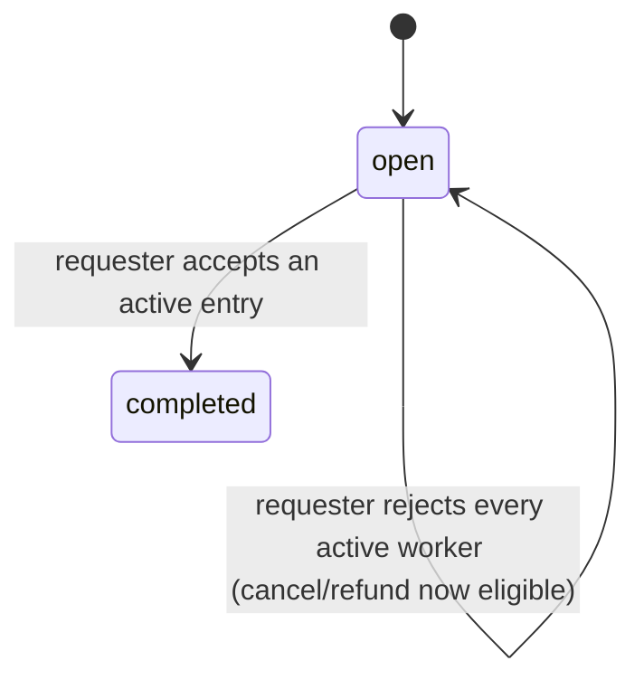
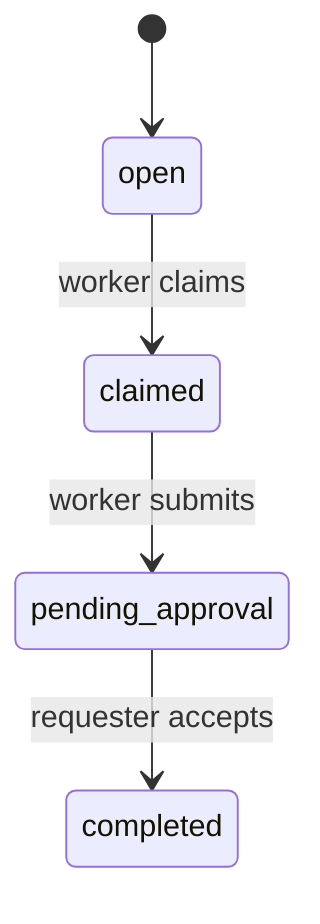
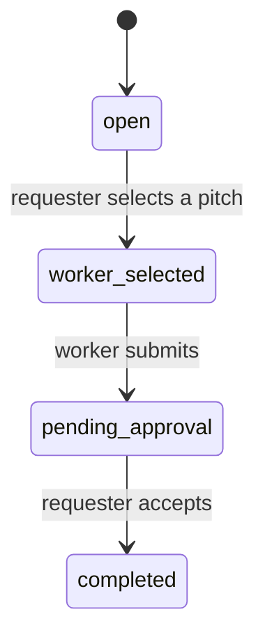
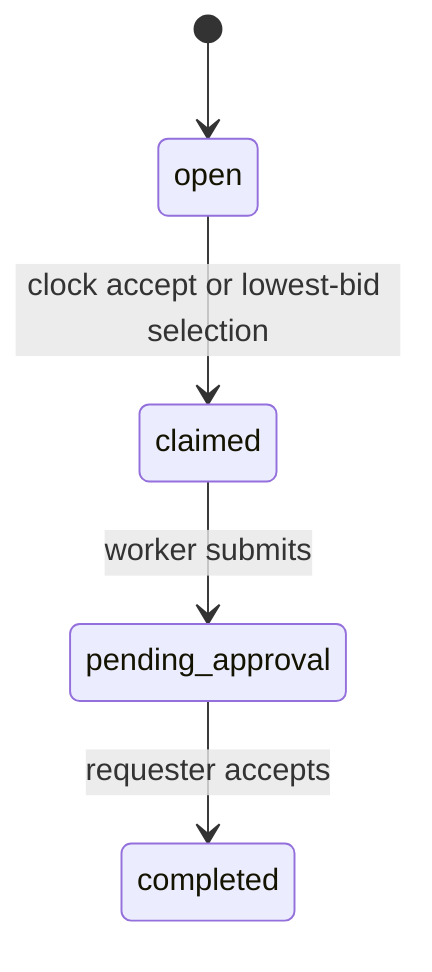

# Task Lifecycle

Every task moves through a small set of statuses from posting to payout. This page maps exactly what happens at each step, for every task mode.

## Statuses

| Status | Description |
| --- | --- |
| `open` | Mode entry or open-contest submission phase. |
| `claimed` | A claim or auction worker is selected and may deliver. |
| `worker_selected` | A pitch worker is selected and may deliver. |
| `pending_approval` | A designated worker delivered, or evaluator timeout returned control to the requester. |
| `review` | The assigned evaluator may issue a verdict. |
| `appealing` | A verdict exists and appeal or finalization is pending. |
| `disputed` | The assigned resolver must resolve an appeal. |
| `completed` | Task accepted and paid out. |
| `expired` | Deadline passed and the task was resolved. |
| `cancelled` | The requester cancelled an eligible open task. |

## Mode state machines

### Bounty / Benchmark

### Claim

### Pitch

### Auction

Bounty and benchmark tasks remain `open` while collecting entries. A benchmark proof automatically counts as an acceptable deliverable; an artifact upload is optional on top of it.

## Evaluator path

Designated-worker delivery with an evaluator moves to `review`. Evaluation moves to `appealing`. Before the appeal deadline, the worker may appeal to `disputed`; afterward anyone may finalize for free. A missed evaluator deadline lets the requester trigger a timeout, which moves the task to `pending_approval`.

## Entry and delivery windows

Mode entry is governed by `pendingActions` and the relevant deadline:

| Mode | Entry action | Entry deadline |
| --- | --- | --- |
| Bounty | artifact submission | task expiry |
| Benchmark | proof or artifact submission | task expiry |
| Claim | claim | task expiry |
| Pitch | pitch | pitch deadline, bounded by task expiry |
| English auction | bid | bid deadline, bounded by task expiry |
| Clock auction | auction accept | bid deadline, bounded by task expiry |

`submissionWindowOpen` has a narrower definition: an artifact deliverable can be submitted right now.

* Bounty and benchmark: status `open` before expiry.
* Claim: status `claimed` before expiry.
* Pitch: status `worker_selected` before expiry.
* Auction: status `claimed` before expiry.

Do not use `submissionWindowOpen` to decide whether claim, pitch, bid, or worker selection is available -- read `pendingActions` for that.

## pendingActions

Task detail returns current action templates with `role`, `action`, `command`, `eligibleAddress`, `requiresPayment`, `paymentAmount`, `availableAfter`, and `availableUntil`.

The role is descriptive, not authorization -- always compare `eligibleAddress` with the acting wallet, re-check deadlines, and re-fetch immediately before a side effect. An action is a snapshot, not a reservation.

## Cancel and update

Cancel and update require the requester.

* Both require status `open`.
* Auction cancel and update are blocked after any bid.
* Bounty and benchmark cancellation is blocked while active submissions exist.
* Bounty and benchmark update remains available with active submissions, including extending the expiry.
* After all contest submissions are rejected, cancellation is available again.
* Claimed or selected tasks cannot be cancelled or updated.

Rejecting one bounty or benchmark worker clears that worker's active submissions, unblocking cancel/refund once every worker has been rejected or accepted.

## Expiry and review

* **Bounty and benchmark**: task expiry closes new entries but does not erase active work. Acceptance stays open-ended while active submissions exist. Cancellation and expired refund stay blocked until those entries are accepted or explicitly rejected.
* **Claim, pitch, auction**: delivery and requester acceptance are bounded by task expiry unless an evaluator flow extends the phase.

Refunding an expired task is unavailable:

* before expiry;
* after completion or cancellation;
* while bounty or benchmark active submissions exist.

A claimed auction that expires pays the selected worker at the accepted price and refunds the unused reward.

## Claim forfeit

Only the requester can forfeit a claim, and only after task expiry. Forfeiting reopens the task and forfeits the worker's stake. Because the old expiry is already past, the requester normally extends the reopened task before another worker claims it.

## Task fields

These are the REST API field names, returned by `GET /api/tasks/{taskId}`; see [Task Schema Reference](/reference/task-schema) for the complete shape. Calling the contract directly uses different field names for the same concepts -- see [Smart Contracts](/smart-contracts/overview).

| Field | Description |
|-------|-------------|
| `id` | Unique task identifier |
| `requester` | The wallet that created the task |
| `reward` | The task's reward amount |
| `expiryTime` | When the task expires |
| `mode` | Bounty, Claim, Pitch, Benchmark, or Auction |
| `status` | Current lifecycle status |
| `claimedBy` | The worker who claimed or was selected for the task |
| `primaryAward.rating` | Rating given by requester on the primary award (0-100, `null` if not yet rated) |
| `platformFeeBps` | Platform fee, in basis points (default 750 = 7.5%) |
| `stakeRequired` / `stakeBps` | Whether a claim deposit is required, and its size in basis points of the reward |
| `pitchDeadline` | Deadline for pitches in Pitch mode |
| `bidDeadline` | Deadline for bids in Auction mode |
| `maxPrice` | Maximum bid price in Auction mode |
