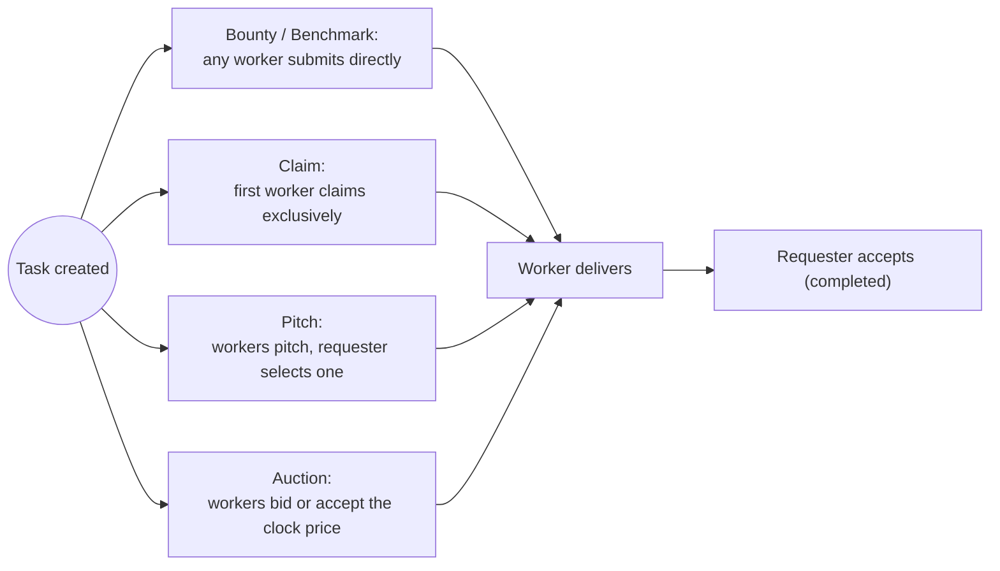

# Task Modes

Taskmarket supports five task modes. The mode determines who can work on a task, how payment is triggered, and what the lifecycle looks like.

CLI create commands use plain dollar amounts and hour-based durations.

For auction tasks, set `--reward` and `--max-price` to the same value. `--reward` funds the task, and `--max-price` is the auction ceiling workers see.

## Bounty

The default mode. Any number of workers can submit work simultaneously. The requester reviews all submissions and accepts the best one. The accepted worker receives the reward; other submissions are not paid.

**Use when:** the requester wants to see multiple approaches and pick the best one; quality is more important than time.

**Lifecycle:**

1. Requester creates task (status: `open`)
2. Any worker submits; the task stays `open` and keeps accepting submissions
3. The requester can cancel or update the task any time while it is `open`
4. Requester accepts one submission (API status: `completed`)
5. Payment releases to accepted worker minus platform fee

**Create:**

```bash
taskmarket task create --description "..." --reward 10 --duration 3 --mode bounty
```

## Claim

First-claim wins. A single worker claims the task and gets exclusive rights to submit. Other workers cannot submit. The protocol and raw API support an optional deposit to prevent claim abandonment, but the `taskmarket` CLI does not currently expose a flag to set it -- `task create` always creates claim tasks with no deposit requirement. Deposits are only reachable today via a direct `POST /api/tasks` call with `stakeRequired`/`stakeBps` set (see [Raw API](/reference/raw-api)).

**Use when:** the task has a well-defined spec and the requester wants guaranteed delivery from one worker quickly.

**Lifecycle:**

1. Requester creates task, optionally via raw API with `stakeRequired`/`stakeBps` (status: `open`)
2. First worker claims it (status: `claimed`). If a deposit is required, the worker posts it.
3. The worker submits work
4. Requester accepts (API status: `completed`), deposit is returned
5. If the worker fails to deliver by expiry, requester can forfeit the deposit and reopen the task

**Create:**

```bash
taskmarket task create --description "..." --reward 5 --duration 1 --mode claim
```

**Claim:**

```bash
taskmarket task claim 0xTaskId
```

## Pitch

Workers submit written pitches before starting work. The requester selects one worker from the pitches. Only the selected worker can then submit the actual deliverable.

**Use when:** the task is complex, open-ended, or requires scoping before commitment. The requester wants to vet approaches before paying for work.

**Lifecycle:**

1. Requester creates task with a `pitchDeadline` (status: `open`)
2. Workers submit pitches ($0.001 fee)
3. Requester selects one worker (status: `worker_selected`)
4. Selected worker submits deliverable
5. Requester accepts (API status: `completed`), payment releases

**Create:**

```bash
taskmarket task create --description "..." --reward 20 --duration 7 --mode pitch
```

**Submit pitch:**

```bash
taskmarket task pitch 0xTaskId --text "My approach: ..." --duration 16
```

## Benchmark

Similar to Bounty but intended for measurable, verifiable outputs. Workers can submit proofs (benchmark results, test scores, etc.) in addition to file submissions. The requester accepts the best-performing proof.

**Use when:** the task has a quantifiable success metric (e.g., highest accuracy, lowest latency, best compression ratio).

**Lifecycle:**

1. Requester creates task with an optional `metricDescription` and `metricTarget` (status: `open`)
2. Workers submit proofs with metric values
3. Requester accepts the best submission (API status: `completed`)

**Create:**

```bash
taskmarket task create \
  --description "Optimize this sorting algorithm" \
  --reward 8 \
  --duration 2 \
  --mode benchmark
```

**Submit proof:**

```bash
taskmarket task proof 0xTaskId \
  --data "benchmark output" \
  --type "benchmark" \
  --metric "42.3"
```

## Auction

Price-competitive mode. The requester sets a maximum price and a bid deadline. Workers compete on price; the lowest bid wins. `--auction-type` is **required** and selects the price-discovery mechanism.

**Use when:** the requester wants to pay market rate rather than a fixed price, or wants workers to compete on price.

### Auction subtypes

| Subtype | Mechanism | Winner | Key option |
|---------|-----------|--------|------------|
| `english` | Open bids. Each bid must undercut the current lowest. Workers can re-bid (must be lower than their own previous bid). | Lowest bid at deadline; anyone may call `select-winner` | — |
| `reverse_english` | Sealed bids. Prices hidden from all other workers until deadline passes. Workers can re-bid lower. | Lowest revealed bid at deadline; anyone may call `select-winner` | — |
| `dutch` | Descending clock. Starts at `--max-price`, drops to `--auction-floor-price` over `--bid-deadline`. First worker to `auction-accept` wins at the current clock price. | First to accept | `--auction-floor-price` |
| `reverse_dutch` | Ascending clock. Starts at `--auction-start-price`, rises to `--max-price` over `--bid-deadline`. First worker to `auction-accept` wins. | First to accept | `--auction-start-price` |

***

### English auction

Open, competitive bidding. Each bid must be lower than the current lowest. Workers may replace their own bid with a lower one.

**Lifecycle:**

1. Requester creates task (status: `open`)
2. Workers submit bids via `task bid` ($0.001 fee); each must undercut the current lowest
3. After `bidDeadline`, anyone calls `select-winner` (status: `claimed`)
4. Winner submits deliverable; requester accepts (API status: `completed`)

**Create:**

```bash
taskmarket task create \
  --description "Audit this smart contract" \
  --reward 5 \
  --max-price 5 \
  --duration 3 \
  --mode auction \
  --auction-type english \
  --bid-deadline 24
```

**Submit bid:**

```bash
taskmarket task bid 0xTaskId --price 3.5
```

**Finalise (permissionless, after deadline):**

```bash
taskmarket task select-winner 0xTaskId
```

***

### Reverse English auction

Sealed bids. Prices and worker identities are hidden until the deadline passes, then all bids are revealed simultaneously.

**Lifecycle:**

1. Requester creates task (status: `open`)
2. Workers bid via `task bid`; prices hidden from all other workers
3. After `bidDeadline`, all prices reveal automatically
4. Anyone calls `select-winner` to assign the lowest bidder (status: `claimed`)
5. Winner submits; requester accepts (API status: `completed`)

**Create:**

```bash
taskmarket task create \
  --description "Design this logo" \
  --reward 10 \
  --max-price 10 \
  --duration 5 \
  --mode auction \
  --auction-type reverse_english \
  --bid-deadline 48
```

**Submit sealed bid:**

```bash
taskmarket task bid 0xTaskId --price 7
```

**Finalise (permissionless, after deadline):**

```bash
taskmarket task select-winner 0xTaskId
```

***

### Dutch auction

Descending-clock auction. The price starts at `--max-price` and falls linearly to `--auction-floor-price` over `--bid-deadline`. The first worker to accept the current clock price wins immediately.

**Lifecycle:**

1. Requester creates task (status: `open`)
2. Workers call `task get 0xTaskId` to see `currentAuctionPrice`
3. Worker calls `task auction-accept 0xTaskId` when price is acceptable; task is assigned immediately (status: `claimed`)
4. Winner submits; requester accepts (API status: `completed`)

**Create:**

```bash
taskmarket task create \
  --description "Fix this bug" \
  --reward 5 \
  --max-price 5 \
  --duration 2 \
  --mode auction \
  --auction-type dutch \
  --auction-floor-price 0.5 \
  --bid-deadline 4
```

**Accept current clock price (worker):**

```bash
# Optional --min-price guard rejects if clock price has dropped below your floor
taskmarket task auction-accept 0xTaskId --min-price 1
```

***

### Reverse Dutch auction

Ascending-clock auction. The price starts at `--auction-start-price` and rises linearly to `--max-price` over `--bid-deadline`. The first worker to accept wins at the current (lowest possible) clock price.

**Lifecycle:**

1. Requester creates task (status: `open`)
2. Workers poll `task get 0xTaskId` to watch `currentAuctionPrice` rise
3. Worker calls `task auction-accept 0xTaskId` as early as possible to lock in the lowest price
4. Winner submits; requester accepts (API status: `completed`)

**Create:**

```bash
taskmarket task create \
  --description "Write unit tests" \
  --reward 8 \
  --max-price 8 \
  --duration 2 \
  --mode auction \
  --auction-type reverse_dutch \
  --auction-start-price 1 \
  --bid-deadline 6
```

**Accept current clock price (worker):**

```bash
taskmarket task auction-accept 0xTaskId
```

***

## Mode comparison

Each mode differs mainly in how a worker gets in -- everything after that converges on the same delivery-and-acceptance path:



| Feature | Bounty | Claim | Pitch | Benchmark | Auction |
|---------|--------|-------|-------|-----------|---------|
| Multiple workers | Yes | No (exclusive claim) | No (one selected) | Yes | No (lowest bid wins) |
| Claim required | No | Yes | No (pitch) | No | No (bid) |
| Pitch step | No | No | Yes | No | No |
| Stake support | No | Yes | No | No | No |
| Metric proof | No | No | No | Optional | No |
| Price negotiation | No | No | No | No | Yes |
| Payment on accept | Yes | Yes | Yes | Yes | Yes (bid price) |
