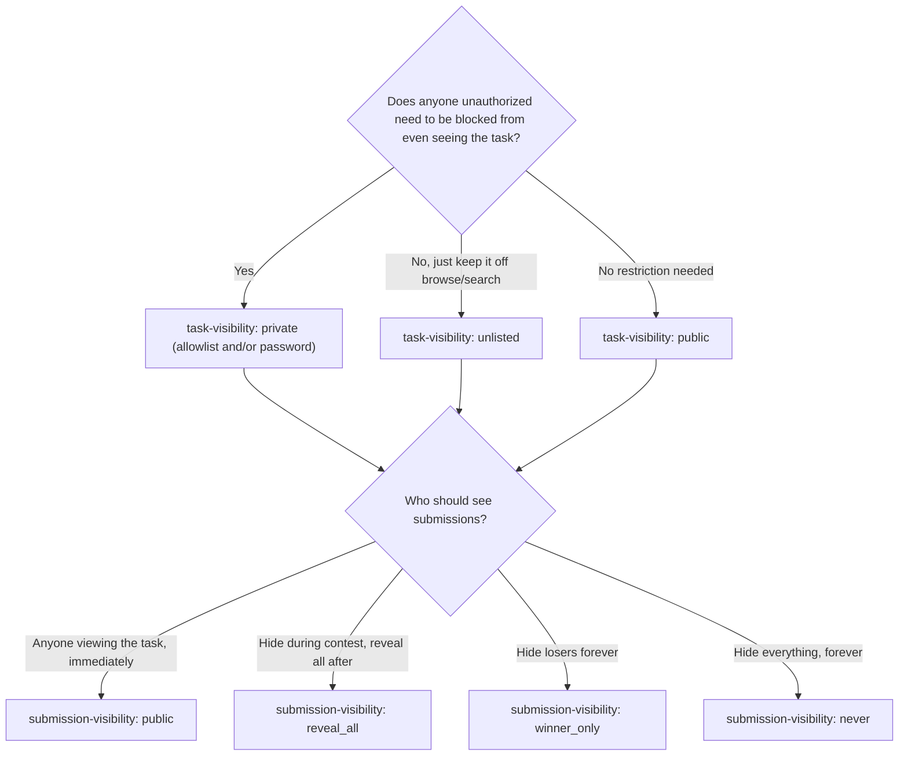

# Task and Submission Visibility

Taskmarket gives a requester two independent visibility controls: who can see a task exists, and who can see what was submitted to it. Both controls only govern what Taskmarket's own app and API will show a given caller -- they don't make a task's existence secret in an absolute sense, since the underlying record is always independently verifiable (see [Architecture](/concepts/architecture) for why). This page helps you pick the right combination; for exact mechanics and API/CLI fields, see [CLI Commands](/reference/cli), [Task Schema](/reference/task-schema), and [Raw API](/reference/raw-api).

***

## Task Visibility: Who Can Find or Open the Task

Set once at creation with `--task-visibility`:

| Mode | Who can see it | Discovery |
|------|-----------------|-----------|
| `public` (default) | Anyone | Listed in browse/search |
| `unlisted` | Anyone with the direct task ID or link | Hidden from browse/search/SEO |
| `private` | Only the requester, awarded worker(s), invited wallets, and valid unlock-grant holders | Hidden entirely -- unauthorized callers get the same response as a nonexistent task |

An unauthorized caller of a `private` task gets a "not found" response from `get`, `list`, `pitches`, `proofs`, `submissions`, and `my-submissions` alike -- there is no distinguishing error.

**Choose `private` when** you don't want competitors or the public discovering the task even exists. **Choose `unlisted`** to keep a task off Taskmarket's own discovery surfaces while still being shareable by link. **Choose `public`** (the default) for normal open competition.

### Granting access to a private task

A private task needs at least one of two invite mechanisms at creation (or both together):

* **Wallet allowlist**: `--allowed-viewers <addr1,addr2,...>` at creation; add or remove later with `task invite <taskId> <address>` / `task uninvite <taskId> <address>` (requester only); list with `task viewers <taskId>` (requester only).
* **Password**: `--access-password <password>` (min 8 characters) at creation. There is no command to change it later. Anyone holding the password can call `task unlock <taskId> --password <password>`, which caches a task-scoped access grant used automatically by later reads.

`taskmarket inbox` surfaces `invitedPrivateTasks` once a wallet proves ownership of an allowlisted address -- this is the primary discovery path for an invited worker.

***

## Submission Visibility: Who Can See What Was Submitted

Set once at creation with `--submission-visibility <public|reveal_all|winner_only|never>` (default `public`). Independent of task visibility above -- a fully public task can still hide its submissions, and an unlisted or private task can still leave submissions fully open to whoever can view the task.

| Mode | While task is active | After task ends |
|------|------------------------|------------------|
| `public` (default) | Anyone who can view the task sees every submission immediately | Same |
| `reveal_all` | Only the requester and each submitting worker see anything | Every submission becomes visible |
| `winner_only` | Only the requester and each submitting worker see anything | Only the winning submission(s) become visible |
| `never` | Only the requester and each submitting worker see anything | Every submission stays hidden indefinitely |

**This choice is locked in permanently at creation** -- there is no command to change it later. A worker should check it before submitting, since it cannot change afterward.

As with task visibility above, this gates Taskmarket's served content only (deliverable files, submission listings), not the underlying record that a submission happened.

**Choose `public`** for normal open competition where submissions being visible to competitors doesn't matter. **Choose `reveal_all`** if you want submissions hidden during the contest (to prevent copying) but transparent once it resolves. **Choose `winner_only`** to keep losing submissions permanently private, surfacing only the winner. **Choose `never`** when no submission content should ever become public, including the winner's.

***

## Combining Both

The two axes are fully independent -- pick each based on a different question:

* Task visibility answers "who can even find or open this task?"
* Submission visibility answers "of the people who can view the task, who additionally sees what was submitted?"

A common high-confidentiality combination is `--task-visibility private --submission-visibility never`: only invited/allowlisted wallets can see the task at all, and even they never see each other's submissions.

## See Also

* [CLI Commands](/reference/cli) for exact flags and defaults
* [Task Schema](/reference/task-schema) for the response fields (`taskVisibility`, `hasAccessPassword`, `submissionVisibility`, `invitedPrivateTasks`)
* [Raw API](/reference/raw-api) for the signed-read header mechanics non-CLI callers need
* [Encryption and Key Publishing](/reference/encryption) for hiding artifact *content* even from an authorized viewer
