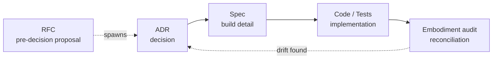

# ADR / RFC / Spec Lifecycle Guide

A high-level map of how an idea becomes a decided, built, and verified thing in this repo. Each
stage links to its own detailed reference — this doc is the connective tissue between them, not a
replacement for any of them.

## The pipeline



The RFC stage is optional — not every decision needs one. A quick, obvious call goes straight to an
ADR. An RFC is for something that genuinely needs discussion first: multiple real options, an
open question, something you want a second pair of eyes on before committing.

## Stage 1 (optional) — RFC: propose, before deciding

**What it is:** a pre-decision proposal inviting comment. Nothing has been decided yet — that's
the entire point of the distinction from an ADR.

**Where:** `docs/rfc/NNNN-<slug>.md`

**Template:** `docs/rfc/_template.md` — Summary / Motivation / Proposal / Open questions /
Non-goals / References.

**Status lifecycle:** `Draft → Discussion → Accepted/Rejected/Superseded`.

**Linting:** deliberately none — an RFC is meant to be a work-in-progress conversation starter, not
a structurally-enforced artifact.

**Full reference:** `docs/rfc/README.md`

## Stage 2 — ADR: record the decision

**What it is:** a terse, one-decision-per-file record of *why* — Y-statement + Considered options,
MADR-lite structure. If an RFC spawned it, the ADR is where the actual decision lands.

**Where:** `docs/adr/NNNN-<slug>.md`

**Template:** `docs/adr/_template.md`

**Status lifecycle:** `Proposed → Accepted` (side states: `Superseded`, `Deprecated`, `Rejected`,
`Withdrawn`).

**Linting:** `make lint-check adr` — blocking: filename format, valid Status, Date present, all
four required sections, no duplicate numbers, an Accepted ADR must have a real (non-blank,
non-placeholder) Deciders value. Warn-only: README index completeness, source changed without a
corresponding ADR, numbering gaps, self-ack smell.

**Full reference:** `docs/adr/README.md`

## Stage 3 — Spec: describe what's being built

**What it is:** an executable spec for an implementation agent — agent meaning a person or an AI.
Post-decision, describes something real in enough detail to build it directly, without re-deriving
the design from a conversation.

**Where:** `docs/specs/<slug>.md`

**Template ("Spec-lite"):** `docs/specs/_template.md` — `Purpose` / `Design / Architecture` /
`Interfaces / Contracts` / optional `Security & Privacy considerations` / `Testing & Verification`
/ `Non-goals` / `References`, with a `**Implements ADRs:**` back-pointer.

**Linting:** `make lint-check specs` — blocking: all required sections present (via an alias list),
valid `Status` (`Draft`/`Ready`/`Superseded`), valid `Date`. Warn-only: a dangling
`Implements ADRs:` reference.

**Full reference:** `docs/specs/README.md`

## Stage 4 — Code / Tests: implementation

Real code and tests that realize an ADR carry a back-pointer comment:

```ts
// Implements: ADR-0032

// Verifies: ADR-0032
```

## Stage 5 — Embodiment audit: reconciliation

**What it is:** a periodic reconciliation that computes what's *actually* realized (from spec/code/
test back-pointers) and compares it against what each ADR *claims* (its `Embodiment` field).

**States:** `Not started → Specified → Implemented → Verified`, plus `Inactive` for
negative-decision ADRs. Drift is any mismatch between stated and computed.

**Run it:** `pnpm --filter @taskmarket/adr run adr-audit` — writes `docs/adr-audit/report.md` (full
per-ADR table) and `summary.json` (structured, consumed by the PR-comment step).

**Where it runs automatically:** GitHub Actions on every PR — posts a compact drift summary as a PR
comment via `pr-comment.cjs`, find-and-updates its own prior comment rather than stacking.

**Full reference:** `docs/adr/README.md`'s "Embodiment (realization tracking)" section.

## Quick reference — "where do I look when..."

| I want to... | Look at |
|---|---|
| Propose something that needs discussion first | `docs/rfc/_template.md` |
| Record a decision that was just made | `docs/adr/_template.md` |
| Write the build detail for a decided ADR | `docs/specs/_template.md` |
| Check whether a decision was actually built | `pnpm --filter @taskmarket/adr run adr-audit`, or `docs/adr-audit/report.md` |
| Check structural compliance before committing | `make lint-check adr` and `make lint-check specs` |

## Known gap (tracked, not yet done)

The Embodiment audit currently reports drift for most `Implemented`-stated ADRs — expected, not a
bug, since real `Implements:`/`Verifies:` back-pointers haven't been backfilled onto the existing
corpus yet. Tracked in [#356](https://github.com/daydreamsai/taskmarket/issues/356): verifying that
code/tests genuinely match each ADR's intent (not just that a plausibly-related file exists), plus
an accuracy audit of existing specs' `Implements ADRs:` claims and a staleness check on RFC status
fields.
